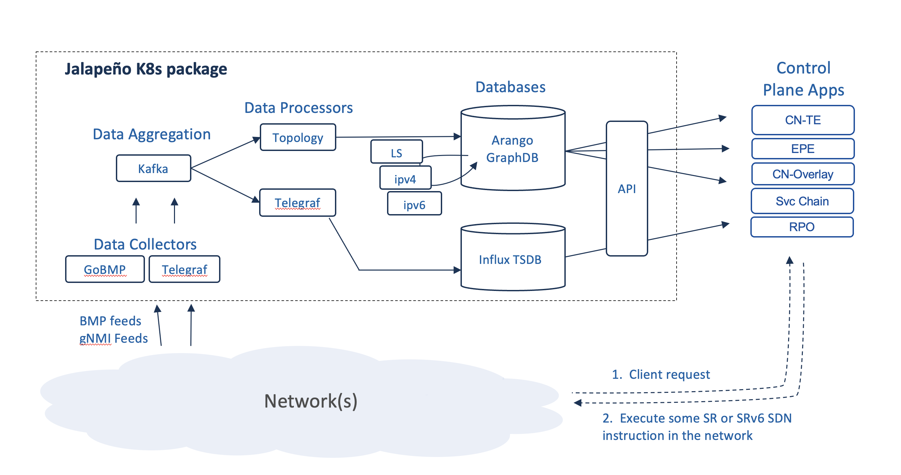

# Jalapeno

### An infrastructure platform to facilitate development of SDN control planes

Jalapeno is an infrastructure platform designed to streamline the development of Software-Defined Networking (SDN) control planes. The project targets a specific class of SDN control planes that can be thought of as "Tunnel Builders," which offer services such as segmentation and path manipulation. Traditionally, these Tunnel Builder control planes have been tailored to specific use cases, and their data collection and topology modeling stacks reflect this specialization. Examples include:

	•	Overlay controllers for data center overlays
	•	Traffic Engineering (TE) controllers for traffic management
	•	SD-WAN controllers, which blend overlay and TE functionalities

Additionally, most existing SDN control planes, apart from those used in Cloud Network Interfaces (CNIs) or Cloud Virtual Private Clouds (VPCs), are constructed with the assumption that routers or switches serve as their primary consumers. These devices typically function as the ingress and egress points for traditional SDN Tunnel Builders.

Project Jalapeno seeks to break out of the silos by providing a platform that is use case, topology, and endpoint agnostic. It features a loosely coupled, modular data collection stack centered around a graph database, enabling the mapping and modeling of any kind of topology. Jalapeno's modular design integrates existing open-source tools with unique services and capabilities we've developed, offering the flexibility and extensibility needed to accelerate the development of innovative SDN control plane applications.

This repository provides documentation and shell scripts to install Jalapeno's component images.

To install Jalapeno and get started, visit the [Getting Started](https://cisco-open.github.io/jalapeno/install/gettingstarted/) guide.

### High level architecture

### High level architecture

#### Platform Overview

At the heart of Jalapeno is the concept that many SDN use cases really involve the creation of virtual topologies whose type and characteristics are driven by dataplane encapsulations (Tunnel Building) and other meta data. And network topologies (whether real or virtual) can be modeled as graphs. Thus, if we think in terms of graphs, we can address any topological use case as an exercise in database mapping. With this framework in mind, Jalapeno has the theoretical ability to address any kind of virtual topology use case, for example:

* Internal Traffic Engineering (TE) - engineered tunnels traversing a network under common management (BGP-LS use cases - see note below**)
* Egress Peer Engineering (EPE) - engineered tunnels sending traffic out a specific egress router/interface to an external network
* SD-WAN - various combinations of TE and EPE
* VPN Overlays / Segmentation - engineered tunnels creating point-to-point or multipoint overlay virtual networks
* Network Slicing - add some SLA to VPN overlays
* VPN Overlays with TE, EPE, SDWAN
* Service Chaining - engineered tunnels, potentially a series of them, linked together via or seamlessly traversing midpoint service nodes
* Service Meshes - generally a service-mesh is more of a layer-7 graph, but the mesh could be augmented with some layer-3 topological service as well

#### Some project principles and goals

* Use-case, topology, and endpoint agnostic - The Host may be the control/encapsulation point (linux, fd.io, eBPF, etc.)
* Give applications the ability to directly choose their network SDN service or SLA
* Enable development of an ecosystem of SDN control applications, tools, and capabilities
* Modular, extensible, microservice architecture
* Emphasize the use of APIs over Protocols for greater agility

#### Jalapeno's key components

Jalapeno is comprised of a series of microservices which can be summarized as:

* **Collectors** - capture network topology and performance data and feed the data to Kafka.  Eventually we wish to incorporate application and server/host performance data as well.  The collection stack also includes Influx TSDB and Grafana for data visualization

* **Data Processors**, Graph Database, and Time-Series Database - Jalapeno has two classes of processors:
  
    * Base data processors: parse topology and performance data coming off Kafka and populate the Influx TSDB and base data collections in the Arango graph database.  The Topology and Telegraf pods are base processors.
    * Virtual Topology or Edge processors: mine the graph and TSDB data collections and then populate virtual topology Edge collections in the graph DB.  Linkstate-edge is an one such processor: <https://github.com/cisco-open/jalapeno/tree/main/linkstate-edge>
  
* Data Processors, Graph Database, and Time-Series Database - Jalapeno has two classes of processors:
  
    * Base data processors: parse topology and performance data coming off Kafka and populate the Influx TSDB and base data collections in the Arango graph database.  The Topology and Telegraf pods are base processors.
    * Virtual Topology or Edge processors: mine the graph and TSDB data collections and then populate virtual topology Edge collections in the graph DB.  Linkstate-edge is an one such processor: <https://github.com/cisco-open/jalapeno/tree/main/linkstate-edge>

* API - expose Jalapeno's virtual topology data for application consumption 
    * An implementation focusing on fetching topology and telemetry data from Jalapeño can be found in a separate GitHub organisation: <https://github.com/jalapeno-api-gateway>
    * An implementation focusing on fetching topology and telemetry data from Jalapeño can be found in a separate GitHub organisation: <https://github.com/jalapeno-api-gateway>

* SR-Apps - mini-applications that mine the graph and time-series databases for the label stack or SRv6 SRH data needed to execute topology or traffic engineering use cases.  Each SR-App should have its own API to field client requests for Segment Routing network services.  

Jalapeno's kubernetes architecture make it inherently extensible, and we imagine the number of collectors, graphDB virtual topology use cases, and SR-Apps to expand significantly as our community grows.

In this example app an end user or application would like to send their backup/background traffic to its destination via the least utilized path, and thus preserve more capacity on the routing protocol's chosen best path. Jalapeno responds to the request with a segment routing label stack that, when appended to outbound packets, will steer traffic over the least utilized path. The app then re-queries Jalapeno every 10 seconds and updates the SR label stack should the least utilized path change.
In this example app an end user or application would like to send their backup/background traffic to its destination via the least utilized path, and thus preserve more capacity on the routing protocol's chosen best path. Jalapeno responds to the request with a segment routing label stack that, when appended to outbound packets, will steer traffic over the least utilized path. The app then re-queries Jalapeno every 10 seconds and updates the SR label stack should the least utilized path change.

#### ** Note on BGP-LS

The key to developing and supporting virtual topology use cases is the programmatic acquisition of topology data.  Traditional SDN-TE platforms focus on Internal-TE and therefore leverage BGP-LS. With Jalapeno we wish to eventually support all the above categories of use case, and therefore we use BGP Monitoring Protocol (BMP) and leverage the GoBMP collector:  <https://github.com/sbezverk/gobmp>. BMP provides a superset of topology data, including:
The key to developing and supporting virtual topology use cases is the programmatic acquisition of topology data.  Traditional SDN-TE platforms focus on Internal-TE and therefore leverage BGP-LS. With Jalapeno we wish to eventually support all the above categories of use case, and therefore we use BGP Monitoring Protocol (BMP) and leverage the GoBMP collector:  <https://github.com/sbezverk/gobmp>. BMP provides a superset of topology data, including:

* BGP-LS topology data
* iBGP and eBGP IPv4, IPv6, and labeled unicast topology data
* BGP VPNv4, VPNv6, and EVPN topology data
