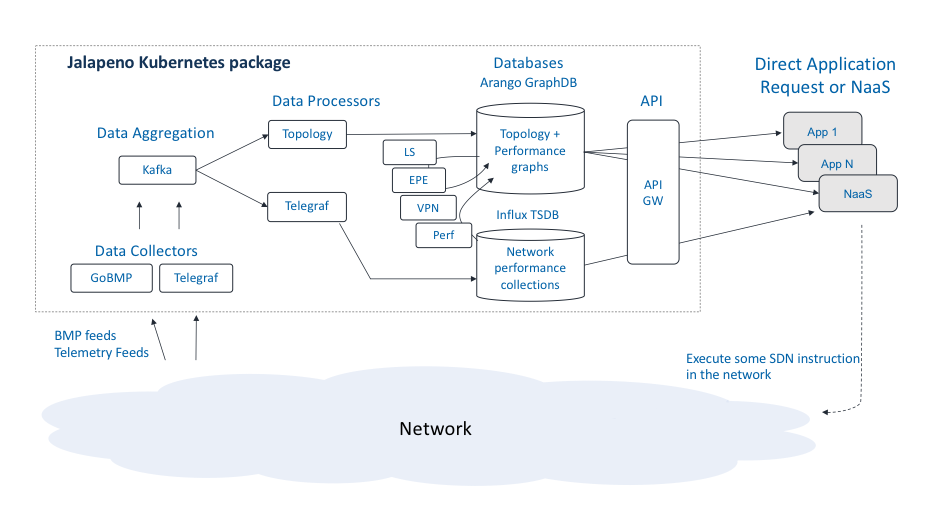

# Jalapeno
### A cloud-native infrastructure platform for network services

To install Jalapeno and get started, visit the [Getting Started](Getting-Started.md) guide.

### High level architecture 

#### Platform Overview: SDN is a Database Problem
At the heart of Jalapeno is the concept that all SDN use cases are really virtual topologies whose type and characteristics are driven by dataplane encapsulations and other meta data. Thus, SDN is database problem.. With this framework in mind, Jalapeno has the theoretical ability to address any kind of virtual topology use case, for example:

* Internal Traffic Engineering (TE) - engineered tunnels traversing a network under common management (BGP-LS use cases - see note below**)
* Egress Peer Engineering (EPE) - engineered tunnels sending traffic out a specific egress router/interface to an external network
* SD-WAN - various combinations of TE and EPE
* VPN overlays - engineered tunnels creating point-to-point or multipoint overlay virtual networks
* Network Slicing - see VPN overlays
* VPN overlays with TE, EPE, SDWAN
* Service Chaining - engineered tunnels, potentially a series of them, linked together via or seamlessly traversing midpoint service nodes 

#### Some project principles and goals
* Give applications the ability to directly choose their service/SLA (path through the network)
* Enable development of an ecosystem of Network Service tools and capabilities
* The Host may be the control/encapsulation point (linux, fd.io, eBPF, other)
* Cloud-native microservice architecture from day 1
* Combine network and application performance data
* Emphasize the use of APIs over Protocols for greater agility

#### Jalapeno's key components

Jalapeno is comprised of a series of microservices which can be summarized as:

* Collectors - capture network topology and performance data and feed the data to Kafka.  Eventually we wish to incorporate application and server/host performance data as well.  The collection stack also includes Influx TSDB and Grafana for data visualization

* Data Processors, Graph Database, and Time-Series Database - Jalapeno has two classes of processors: 
  * Base data processors: parse topology and performance data coming off Kafka and populate the Influx TSDB and base data collections in the Arango graph database.  The Topology and Telegraf pods are base processors.
  * Virtual_Topology processors: mine the graph and TSDB data collections and then populate virtual topology collections in the graph DB.  LS, EPE, and L3VPN, are examples of virtual topology processors (see https://github.com/jalapeno/demo-processors).

* API-GW - expose Jalapeno's virtual topology data for application consumption

* SR-Apps - mini-applications that mine the graph and time-series databases for the label stack or SRv6 SRH data needed to execute topology or traffic engineering use cases.  Each SR-App should have its own API to field client requests for Segment Routing network services.  

Jalapeno's kubernetes architecture make it inherently extensible, and we imagine the number of collectors, graphDB virtual topology use cases, and SR-Apps to expand significantly as our community grows.

Jalapeno's hello-world sample app is called "LUP" or Least-Utilized-Path.  https://github.com/jalapeno/sr-app-lup

In this example app an end user or application would like to send their backup/background traffic to its destination via the least utilized path, and thus preserve more capacity on the routing protocol's chosen best path. Jalapeno responds to the request with a segment routing label stack that, when appended to outbound packets, will steer traffic over the least utilized path. The app then re-queries Jalapeno every 10 seconds and updates the SR label stack should the least utilized path change.   

#### ** Note on BGP-LS

The key to developing and supporting virtual topology use cases is the programmatic acquisition of topology data.  Traditional SDN-TE platforms focus on Internal-TE and therefore leverage BGP-LS. With Jalapeno we wish to eventually support all the above categories of use case, and therefore we use BGP Monitoring Protocol (BMP) and leverage the GoBMP collector:  https://github.com/sbezverk/gobmp. BMP provides a superset of topology data, including:

* BGP-LS topology data
* iBGP and eBGP IPv4, IPv6, and labeled unicast topology data
* BGP VPNv4, VPNv6, and EVPN topology data

