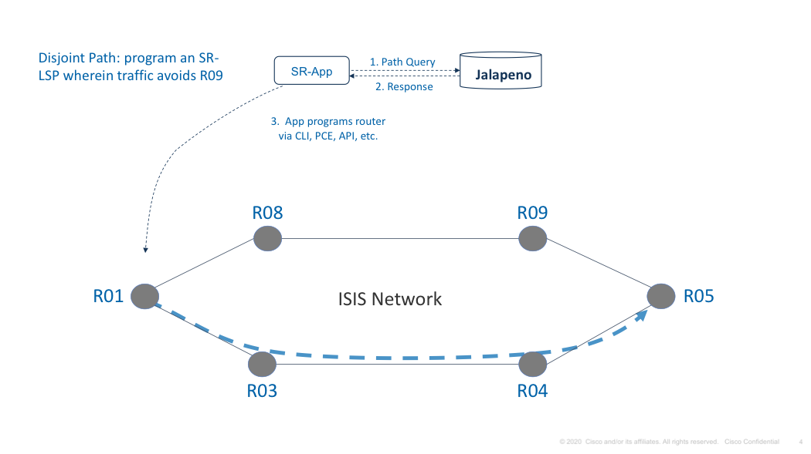

###  AQL queries to build a Hello World SR-App

#### This hello-world app uses Jalapeno's demo-processors (https://github.com/jalapeno/demo-processors), which create the Arango collections shown in the sample queries below.

#### The goal of this SR-App is to get the SR label stack for the least utilized path between Node 0007 and Node 0019:

1. Query to get the full link-state topology
```
for l in LSv4TopologyDemo return l
```


#### A couple queries to get topology context:

2. Query to determine shortest-path hop-count from Node 7 to Node 19, and whether we have an ECMP paths:
```
RETURN LENGTH(
FOR v IN OUTBOUND 
SHORTEST_PATH 'LSNodeDemo/0000.0000.0007' TO 'LSNodeDemo/0000.0000.0019' LSv4TopologyDemo
 Return v
)
```
Output
```
[
  4
]
```
The AQL Output of 4 includes the source node.  From a routing perspective the source node is not includes, so our hop-count is 3

2. Query for ECMP paths should they exist.  The '3..3' notation gives us the hop count:
```
FOR v, e, p IN 3..3 OUTBOUND "LSNodeDemo/0000.0000.0007" LSv4TopologyDemo
     FILTER v._id == "LSNodeDemo/0000.0000.0019"
       RETURN CONCAT_SEPARATOR(" -> ", p.vertices[*].router_id)
```
Output
```
[
  "10.0.0.7 -> 10.0.0.8 -> 10.0.0.16 -> 10.0.0.13",
  "10.0.0.7 -> 10.0.0.8 -> 10.0.0.16 -> 10.0.0.13",
  "10.0.0.7 -> 10.0.0.9 -> 10.0.0.12 -> 10.0.0.13"
]
```

3. With that bit of background information we now Query for the shortest path based on interface utilization:
```
FOR v, e IN OUTBOUND SHORTEST_PATH 'LSNodeDemo/0000.0000.0007' TO 'LSNodeDemo/0000.0000.0019' LSv4TopologyDemo
    OPTIONS {weightAttribute: 'Percent_Util_Outbound'}
    FILTER e != null
    RETURN [v.router_id, e.remote_prefix_sid]
```
Output
```
[
  [
    "10.0.0.8",
    100008
  ],
  [
    "10.0.0.16",
    100016
  ],
  [
    "10.0.0.13",
    100013
  ]
]
```
The above query output can be used to create an SR-policy or label-stack which carries traffic over the least utilized path from Node 7 to Node 19

Just for fun, a query showing all paths from Node 7 to Node 19 that can be completed in 5 hops or less:
```
FOR v, e, p IN 1..5 OUTBOUND "LSNodeDemo/0000.0000.0007" LSv4TopologyDemo
     FILTER v._id == "LSNodeDemo/0000.0000.0019"
       RETURN { "RouterID": p.vertices[*].router_id, "PrefixSID": p.edges[*].remote_prefix_sid }
```
Partial Output:
```
["10.0.0.7","10.0.0.9","10.0.0.12","10.0.0.3","10.0.0.16","10.0.0.13"]	[100009,100012,100003,100016,100013]
["10.0.0.7","10.0.0.9","10.0.0.12","10.0.0.3","10.0.0.16","10.0.0.13"]	[100009,100012,100003,100016,100013]
["10.0.0.7","10.0.0.9","10.0.0.12","10.0.0.3","10.0.0.12","10.0.0.13"]	[100009,100012,100003,100012,100013]
["10.0.0.7","10.0.0.9","10.0.0.12","10.0.0.3","10.0.0.16","10.0.0.13"]	[100009,100012,100003,100016,100013]
["10.0.0.7","10.0.0.9","10.0.0.12","10.0.0.3","10.0.0.16","10.0.0.13"]	[100009,100012,100003,100016,100013]
["10.0.0.7","10.0.0.9","10.0.0.12","10.0.0.4","10.0.0.16","10.0.0.13"]	[100009,100012,100004,100016,100013]
["10.0.0.7","10.0.0.9","10.0.0.12","10.0.0.4","10.0.0.16","10.0.0.13"]	[100009,100012,100004,100016,100013]
["10.0.0.7","10.0.0.9","10.0.0.12","10.0.0.4","10.0.0.12","10.0.0.13"]	[100009,100012,100004,100012,100013]
["10.0.0.7","10.0.0.9","10.0.0.12","10.0.0.10","10.0.0.12","10.0.0.13"]	[100009,100012,100010,100012,100013]
["10.0.0.7","10.0.0.9","10.0.0.12","10.0.0.10","10.0.0.16","10.0.0.13"]	[100009,100012,100010,100016,100013]
["10.0.0.7","10.0.0.9","10.0.0.12","10.0.0.10","10.0.0.16","10.0.0.13"]	[100009,100012,100010,100016,100013]
["10.0.0.7","10.0.0.9","10.0.0.12","10.0.0.13"]	[100009,100012,100013]
["10.0.0.7","10.0.0.9","10.0.0.12","10.0.0.13","10.0.0.16","10.0.0.13"]	[100009,100012,100013,100016,100013]
["10.0.0.7","10.0.0.9","10.0.0.12","10.0.0.13","10.0.0.16","10.0.0.13"]	[100009,100012,100013,100016,100013]
["10.0.0.7","10.0.0.9","10.0.0.12","10.0.0.13","10.0.0.16","10.0.0.13"]	[100009,100012,100013,100016,100013]
["10.0.0.7","10.0.0.9","10.0.0.12","10.0.0.13","10.0.0.16","10.0.0.13"]	[100009,100012,100013,100016,100013]
```


