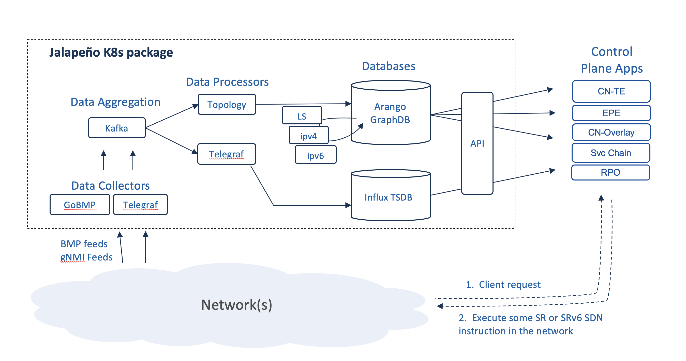

# About Jalapeno

This section contains details about the overall design of Jalapeno, including notes about the different components of the project.

## High level architecture

The diagram below provides an general idea of the architecture behind the project & intended interaction between components. Within the pages of this section, We'll dive into each of these components separately to describe their functions.

## Platform Overview

> **SDN is a Database Problem**

### Platform Overview

At the heart of Jalapeno is the concept that many SDN use cases really involve the creation of virtual topologies whose type and characteristics are driven by dataplane encapsulations and other meta data *(Tunnel Building)* . And network topologies (whether real or virtual) can be modeled as graphs. Thus, if we think in terms of graphs, we can address any topological use case as an exercise in database mapping. With this framework in mind, Jalapeno has the theoretical ability to address any kind of virtual topology use case, for example:

* **Internal Traffic Engineering (TE)** - engineered tunnels traversing a network under common management ([BGP-LS](#a-note-on-bgp-ls) use cases - see note below)
* **Egress Peer Engineering (EPE)** - engineered tunnels sending traffic out a specific egress router/interface to an external network
* **SD-WAN** - various combinations of TE and EPE
* **VPN Overlays / Segmentation** - engineered tunnels creating point-to-point or multipoint overlay virtual networks
* **Network Slicing** - add some SLA to VPN overlays
* **VPN Overlays with TE, EPE, SDWAN** - various combinations of Overlay and TE services
* **Service Chaining** - engineered tunnels, potentially a series of them, linked together via or seamlessly traversing midpoint service nodes
* **Service Meshes** - generally a service-mesh is more of a layer-7 graph, but the mesh could be augmented with some layer-3 topological service as well

#### Some project principles and goals

* Use-case, topology, and endpoint agnostic - The host, hypervisor, CNI, or other endpoint may be the control/encapsulation point (linux, fd.io, eBPF, etc.)
* Give applications the ability to directly choose their network SDN service or SLA
* Enable development of an ecosystem of SDN control applications, tools, and capabilities
* Modular, extensible, microservice architecture
* Emphasize the use of APIs over Protocols for greater agility

## Key Components

Jalapeno is comprised of a series of microservices which can be summarized as:

- [Collectors](./collectors.md)
    - Capture network topology and performance data and feed the data to Kafka.  Eventually we wish to incorporate application and server/host performance data as well.  The collection stack also includes Influx TSDB and Grafana for data visualization.

- [Processors](./processors.md)
    - Data Processors
    - Jalapeno has two classes of processors:
        - Base data processors: Parse topology and performance data coming off Kafka and populate the Influx TSDB and base data collections in the Arango graph database.  The [Topology](./processors.md#topology-processor) and Telegraf pods are base processors.
        - Virtual Topology or Edge processors: Mine the graph and TSDB data collections, then populate virtual topology Edge collections in the graph DB.  [Linkstate-edge](https://github.com/cisco-open/jalapeno/tree/main/linkstate-edge) is an one such processor.

- [Infrastructure](./infrastructure.md)
    - Kafka: used as a message bus between data collectors and processors. Can also be leveraged by outside systems that wish to subscribe to Jalapeno Kafka topics.
    - Arango Graph Database: used for topology modeling and as a document or key-value store. 
    - Influx Time Series Database: used for collection and warehousing of streaming telemetry data from Telegraf/gNMI.

- [API](https://github.com/jalapeno-api-gateway) - expose Jalapeno's virtual topology data for application consumption (API-GW is under construction)
    - An implementation focusing on fetching topology and telemetry data from Jalapeño can be found in a separate GitHub organisation

* **Control Plane Applications** - SDN control applications that mine the graph and time-series databases for the label stack or SRv6 SRH data needed to execute topology or traffic engineering use cases. 

In an example use case, an end user or application would like to send their backup/background traffic to its destination via the least utilized path. The intent would be to preserve more capacity on the routing protocol's chosen best path. Jalapeno responds to the request with a segment routing label stack that, when appended to outbound packets, will steer traffic over the least utilized path. The app then re-queries Jalapeno every 10 seconds and updates the SR label stack should the least utilized path change.

Jalapeno's kubernetes architecture make it inherently extensible, and we imagine the number of collectors, graphDB virtual topology use cases, and control plane applications to expand significantly as our community grows.

## A Note on BGP-LS

The key to developing and supporting virtual topology use cases is the programmatic acquisition of topology data. Traditional SDN-TE platforms focus on Internal-TE and therefore leverage BGP-LS. With Jalapeno we wish to eventually support all the above categories of use case, and therefore we use BGP Monitoring Protocol (BMP) and leverage the [GoBMP collector](https://github.com/sbezverk/gobmp).

BMP provides a superset of topology data, including:

- BGP-LS topology data
- iBGP and eBGP IPv4, IPv6, and labeled unicast topology data
- BGP VPNv4, VPNv6, and EVPN topology data
