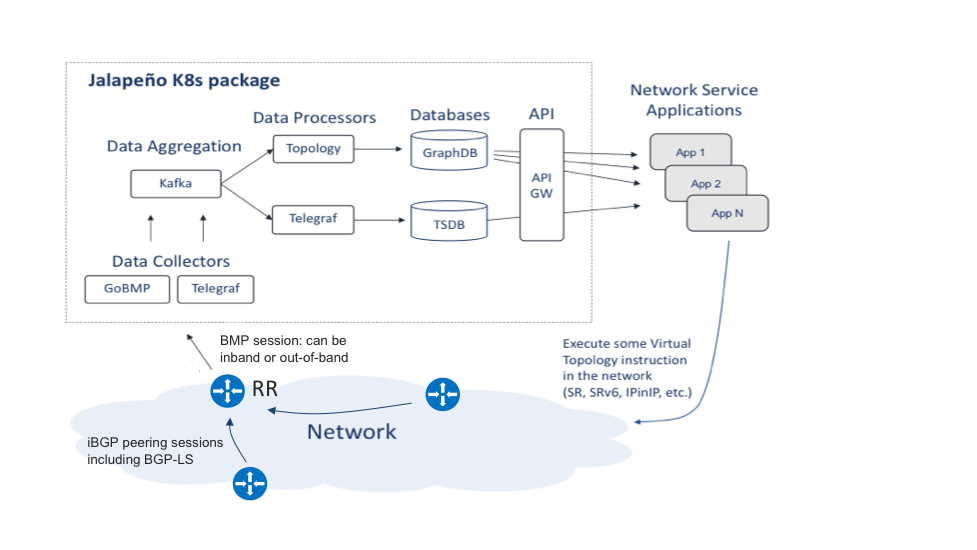

# IOS-XR

This section contains notes on IOS-XR router configs and network design.

## Segment Routing

1. SRGB: we use a custom label block in our lab.  The default is 16000 - 23999.

    ```yaml
    segment-routing
     global-block 100000 163999   
    ```

2. Enable SR in ISIS

    ```yaml
    router isis 100
     is-type level-2-only
     net 49.0901.0000.0000.0006.00
     address-family ipv4 unicast
      metric-style wide
      advertise link attributes
      mpls traffic-eng level-2-only
      mpls traffic-eng router-id Loopback0
      maximum-paths 32
      segment-routing mpls
     !
     interface Loopback0
      passive
      address-family ipv4 unicast
       prefix-sid absolute 100006 #(1)!
      !
    ```

    1. This can also be an SRGB index value

3. Enable distribution of SR Prefix-SID information in BGP-LU (Optional, but very valuable for multi-domain networks)

    ```yaml
    route-policy SID($SID)
      set label-index $SID
    end-policy
    !
    router bgp 100000
    !
     address-family ipv4 unicast
      network 10.0.0.1/32 route-policy SID(1) #(1)! 
      allocate-label all
     !
     neighbor 10.1.1.0   #(2)!
      remote-as 65000
      !       
      address-family ipv4 labeled-unicast
       route-policy pass in
       route-policy pass out
    !
    ```

    1. BGP Prefix-SID index 1, results in SR label value 100001 based on our SRGB
    2. ASBR

### Setting up BMP and BGP-LS

#### Diagram



### BGP-LS

1. Setup route-reflectors to receive LS messages from clients, but to not pass LS messages back out:

    ```yaml
    BGP-LS specific information shown:

    router bgp 100000
     !
     address-family link-state link-state
     !
     neighbor <neighbor IP>
      address-family link-state link-state
       route-policy pass in
       route-policy drop out
    ```

!!! note
    The RR's technically only need a copy of BGP-LS/LSDB from one router.

2. Configure one or more RR clients to pass LS messages to the RR's.  

    BGP-LS specific information shown:

    ```yaml
    
    router isis 100
     distribute link-state level 2 #(1)!
     !
     address-family ipv4 unicast
      advertise link attributes #(2)!
     !
    router bgp 100000
     !
     address-family link-state link-state
     !
     neighbor 192.0.2.50 #(3)!
      !
      address-family link-state link-state
       route-policy drop in
       route-policy pass out
    ```

    1. Distribute my LSDB into local BGP-LS
    2. All ISIS nodes should have this line as it adds their SR TLVs into the domain's LSDB
    3. Route Reflector

3. Add Egress Peer Engineering data to BGP-LS feed (Optional)

    On an ASBR node, or Internet peering node add the following (it is assumed v4/v6 AFIs are already enabled):

    ```yaml
    router bgp 100000
     !
     address-family link-state link-state
     !
     neighbor 192.0.2.50 #(1)!
      !       
      address-family link-state link-state
       route-policy pass out
       !
      !
     neighbor 203.0.113.50 #(2)!
      remote-as 64496 
      egress-engineering
     !
    ```

    1. Route Reflector
    2. External Peer

### BMP (BGP Monitoring Protocol)

We collect topology data with BMP as it provides data from multiple AFI/SAFI combinations (not just BGP-LS)
While we anticipate most operators to run a BGP-free core, we'll generally want to collect BMP messages from route-reflectors and all BGP speakers with external facing peering sessions (ASBRs, Peering, etc.):

1. Configure BMP Server on RR's and on ASBRs and peering routers:

    ```yaml
    bmp server 1
     host 10.0.250.2 port 30511
     description Jalapeno GoBMP 
     update-source Loopback0 #(1)!
     flapping-delay 60
     initial-delay 5
     stats-reporting-period 60
     initial-refresh delay 30 spread 2
    ```

    1. Alternatively, `update-source MgmtEth0/RP0/CPU0/0`

2. Configure export of BMP data for BGP messages/advertisements from specific peers:
    1. Route reflector

        ```yaml
        router bgp 100000
        neighbor <neighbor IP> #(1)!
        bmp-activate server 1
        ```

        1. Assuming clients are VPNv4/v6 PE's, this also captures VPNv4/6 messages

    2. ASBR/Peering

        ```yaml
         router bgp 100000
         !
         neighbor 192.0.2.100
          remote-as 64500
          description External Peer 72
          egress-engineering
          bmp-activate server 1
        ```

### Streaming Telemetry (Model Driven Telemetry)

The following configuration snippet provides a reference for sending streaming telemetry to Jalapeno.

```yaml
telemetry model-driven
destination-group jalapeno
    vrf <name> // optional 
    address-family ipv4 192.0.2.10 port 32400
    encoding self-describing-gpb
    protocol grpc no-tls
    !
!
sensor-group cisco_models 
    sensor-path Cisco-IOS-XR-pfi-im-cmd-oper:interfaces/interface-xr/interface #(1)!
    sensor-path Cisco-IOS-XR-infra-tc-oper:traffic-collector/afs/af/counters/prefixes/prefix #(2)!
    sensor-path Cisco-IOS-XR-fib-common-oper:mpls-forwarding/nodes/node/label-fib/forwarding-details/forwarding-detail #(3)!
!
sensor-group openconfig_interfaces
    sensor-path openconfig-interfaces:interfaces/interface #(4)!
!
subscription base_metrics
    sensor-group-id cisco_models sample-interval 10000
    sensor-group-id openconfig_interfaces sample-interval 10000
    destination-id jalapeno
    source-interface MgmtEth0/RP0/CPU0/0
!
```

1. Interface statistics
2. SR traffic collector statistics
3. Per-MPLS label forwarding statistics
4. Openconfig interface statistics
