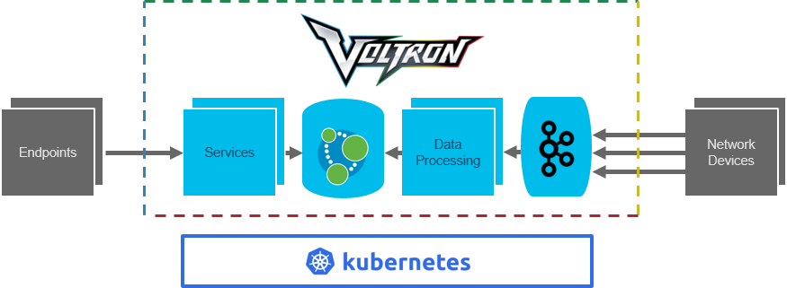

# Voltron High-level Software Architecture

## Overview

Voltron provides a framework for:
1. collecting and processing network telemetry from a heterogeneous population of network devices
2. storing a model of the network topology and updating that model based on processed telemetry
3. running services that can query the model and expose an API to network endpoints

At its core Voltron is comprised of two scalable data structures:
1. a message queue for processing network telemetry
2. a graph database for storing the network topology and information about that topology

The message queue is fed by network devices (or forwarders that are actively collecting metrics on behalf of network devices). Tools such as Pipeline and Telegraf are used to forward metrics to the message queue. Metrics should be forwarded based on a configurable interval.

The message queue itself must provide an asynchronous interface and must easily scale to handle many thousands of messages per second. For this purpose, Kafka is chosen as the initial message queue for implementing Voltron.

Between the message queue and the graph database lies a data processing layer. The complexity of this layer very much depends on the Voltron use cases and sophistication of analysis required for achieving those use cases. Initially, a simple custom tool will be written that subscribes to the message queue, parses messages, handles rudimentary analysis, and updates the network model in the graph database. This component must be stateless and must be horizontally scalable. As more types of network devices and more types of telemetry are handled by Voltron, a more extensible framework for processing that data may be necessary. Tools such as Apache Spark Streaming or Apache Storm may provide useful frameworks for consuming telemetry from Kafka, processing it through multiple stages, and updating Neo4j. In the absence of such a framework, simple data processing extensibility can also be achieved through arbitrary programs which consume messages from Kafka and update Neo4j based on those messages.

The graph database itself must offer a graph query interface and must be capable of handling a high rate of updates. For this purpose, Neo4j is chosen as the initial graph database for implementing Voltron. The network topology can be inferred from the network device telemetry and will be built dynamically in Neo4j by the data processing layer.

The services must be flexible and Voltron must offer a framework for running any type of service. Services must have access to the Neo4j graph database in order to make intelligent decisions based on their domain-specific algorithms. Each service may offer its own domain-specific API. For this purpose, Kubernetes is chosen as an application lifecycle manager and clustering tool. Containers and Kubernetes provide a useful abstraction for creating custom services with direct access to a graph database API.

## Project Phasing

### Phase 1 - Core Functionality

The core functionality reflects the above description of Voltron. The only point of extensibility is the framework for running services. In the initial implementation, all components are deployed on a single Kubernetes cluster.

### Phase 2 - Service Framework

As the Voltron team gains sufficient experience with writing these services and working with the Neo4j API, patterns may emerge that could be institutionalized within a common framework wrapping the Neo4j API.

Experience with writing Voltron services might also reveal that services should keep a local cache of state, rather than relying on Neo4j for each query. Further, such a local cache may benefit from real-time updates via a message queue.

### Phase 3 - Service Composability

While the number of initial services should be small, a fully-fledged Voltron might expose a large catalog of services with strict interdependencies. Each new service might build on the API and capabilities of existing services. Such dependencies could be defined as part of the service catalog. Voltron could explicitly enforce dependency rules before deploying a service. A service dependency tool such as [Sigma](sigma-dev.github.io/sigma/) could enable this concept of composability.

### Future Phases

In the future, more sophistication can be added to Voltron. A few examples are described in this section with limited detail.

#### Cloud Offload

In addition to running Voltron itself in a cloud environment, individual pieces of Voltron could be offloaded to a public cloud. For example, Kafka could be used to vector messages off to both a local Voltron instance as well as a cloud-hosted Voltron. In a cloud hosted environment, more big data tools may be available for telemetry analysis, the result of which could be fed back to an on-premises Voltron instance.

#### Multi-site & Federation

A multi-site Voltron deployment might map well to a division of responsibilities in the network. For example, an operator might deploy one Voltron instance for their WAN and one for each data center network. An endpoint in one data center wishing to connect with an endpoint in another data center may need to contact multiple Voltron instances to determine a low latency path between them. Some form of Voltron federation could simplify such a query.

#### Time-series Data

In addition to relying on the instantaneous state of the network, Voltron could also store and expose historical information. However, Neo4j may not be the ideal tool for this purpose and the architecture should be reassessed if time-series data becomes a requirement.

## Packaging & Deploy Automation

*TODO: describe how Voltron infra, framework, and services will be packaged and deployed*

## Configuration

*TODO: describe important points of configuration*

## User Interface

*TODO: describe the end-user interface*

## Logging & Monitoring

*TODO: describe requirements and mechanism for monitoring voltron*

## High Availability

*TODO: describe the high availability story for Voltron*

## Test Considerations

*TODO: describe the test strategy for voltron*

## Development Environment

*TODO: describe the development environment, CI pipeline, and any developer tooling*

## Documentation

*TODO: describe what tools will be used for generating documentation*

## Open Questions

1. What does telemetry contain? Is it documented?
