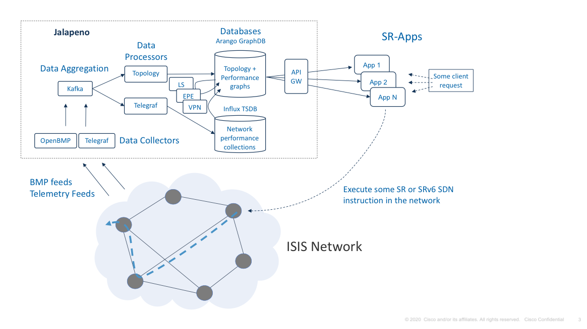

## Documentation describing link-state related virtual topology use cases and design
### Use cases include: internal traffic engineering, path steering, SRTE, explicit path TE, etc.

### LS Topology Model 

The link-state topology processor (LS_Topology) collects all LSNode and LSLink data 
