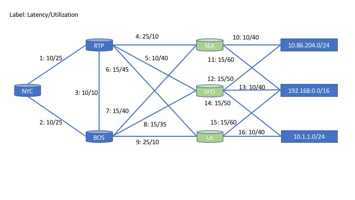

# Example Topology



This is an example lab topology that lets one query against a populated topology. This topology has
latency values, utilization scores and labels populated. It shows that a single simple query is all
that is required to get the path through the graph.

## Populating your own arangoDB

1. Deploy the arango container using `./framework/arango/deploy.sh`
2. Run this executable. `cd arango/example && go run main.go`
3. Log into the WebUI or use the Simple Query HTTP API and run queries.

## Shortest Path Queries

**Latency**
```
FOR v,e
IN OUTBOUND SHORTEST_PATH
'Routers/NYC_1' TO 'Prefixes/10.86.204.0_24'
GRAPH 'topology'
OPTIONS {weightAttribute: "Latency"}
return {v,e}
```

**Result**
```
[
  {
    "v": {
      "_key": "NYC_1",
      "_id": "Routers/NYC_1",
      "_rev": "_VsgrIo2---",
      "BGPID": "NYC",
      "ASN": "1"
    },
    "e": null
  },
  {
    "v": {
      "_key": "RTP_1",
      "_id": "Routers/RTP_1",
      "_rev": "_VsgrIpG---",
      "BGPID": "RTP",
      "ASN": "1"
    },
    "e": {
      "_key": "RoutersNYC_1_RoutersRTP_1_NYC_1_RTP_1",
      "_id": "LinkEdges/RoutersNYC_1_RoutersRTP_1_NYC_1_RTP_1",
      "_from": "Routers/NYC_1",
      "_to": "Routers/RTP_1",
      "_rev": "_VsgrIqC---",
      "FromIP": "NYC_1",
      "ToIP": "RTP_1",
      "Netmask": "",
      "Labels": [
        1
      ],
      "Latency": 10,
      "Utilization": 25
    }
  },
  {
    "v": {
      "_key": "SEA_2",
      "_id": "Routers/SEA_2",
      "_rev": "_VsgrIpa---",
      "BGPID": "SEA",
      "ASN": "2"
    },
    "e": {
      "_key": "RoutersRTP_1_RoutersSEA_2_RTP_1_SEA_2",
      "_id": "LinkEdges/RoutersRTP_1_RoutersSEA_2_RTP_1_SEA_2",
      "_from": "Routers/RTP_1",
      "_to": "Routers/SEA_2",
      "_rev": "_VsgrIrO---",
      "FromIP": "RTP_1",
      "ToIP": "SEA_2",
      "Netmask": "",
      "Labels": [
        4
      ],
      "Latency": 25,
      "Utilization": 10
    }
  },
  {
    "v": {
      "_key": "10.86.204.0_24",
      "_id": "Prefixes/10.86.204.0_24",
      "_rev": "_VsgrIta---",
      "Prefix": "10.86.204.0",
      "Length": 24
    },
    "e": {
      "_key": "Routers_SEA_2_Prefixes_10.86.204.0_24",
      "_id": "PrefixEdges/Routers_SEA_2_Prefixes_10.86.204.0_24",
      "_from": "Routers/SEA_2",
      "_to": "Prefixes/10.86.204.0_24",
      "_rev": "_VsgrIuC---",
      "Latency": 10,
      "Utilization": 40,
      "Labels": [
        10
      ]
    }
  }
]
```

**Utilization**
```
FOR v,e
IN OUTBOUND SHORTEST_PATH
'Routers/NYC_1' TO 'Prefixes/10.86.204.0_24'
GRAPH 'topology'
OPTIONS {weightAttribute: "Utilization"}
return {v,e}
```

**Result**
```
[
  {
    "v": {
      "_key": "NYC_1",
      "_id": "Routers/NYC_1",
      "_rev": "_VsgrIo2---",
      "BGPID": "NYC",
      "ASN": "1"
    },
    "e": null
  },
  {
    "v": {
      "_key": "RTP_1",
      "_id": "Routers/RTP_1",
      "_rev": "_VsgrIpG---",
      "BGPID": "RTP",
      "ASN": "1"
    },
    "e": {
      "_key": "RoutersNYC_1_RoutersRTP_1_NYC_1_RTP_1",
      "_id": "LinkEdges/RoutersNYC_1_RoutersRTP_1_NYC_1_RTP_1",
      "_from": "Routers/NYC_1",
      "_to": "Routers/RTP_1",
      "_rev": "_VsgrIqC---",
      "FromIP": "NYC_1",
      "ToIP": "RTP_1",
      "Netmask": "",
      "Labels": [
        1
      ],
      "Latency": 10,
      "Utilization": 25
    }
  },
  {
    "v": {
      "_key": "SFO_2",
      "_id": "Routers/SFO_2",
      "_rev": "_VsgrIpu---",
      "BGPID": "SFO",
      "ASN": "2"
    },
    "e": {
      "_key": "RoutersRTP_1_RoutersSFO_2_RTP_1_SFO_2",
      "_id": "LinkEdges/RoutersRTP_1_RoutersSFO_2_RTP_1_SFO_2",
      "_from": "Routers/RTP_1",
      "_to": "Routers/SFO_2",
      "_rev": "_VsgrIri---",
      "FromIP": "RTP_1",
      "ToIP": "SFO_2",
      "Netmask": "",
      "Labels": [
        5
      ],
      "Latency": 10,
      "Utilization": 40
    }
  },
  {
    "v": {
      "_key": "10.86.204.0_24",
      "_id": "Prefixes/10.86.204.0_24",
      "_rev": "_VsgrIta---",
      "Prefix": "10.86.204.0",
      "Length": 24
    },
    "e": {
      "_key": "Routers_SFO_2_Prefixes_10.86.204.0_24",
      "_id": "PrefixEdges/Routers_SFO_2_Prefixes_10.86.204.0_24",
      "_from": "Routers/SFO_2",
      "_to": "Prefixes/10.86.204.0_24",
      "_rev": "_VsgrIua---",
      "Latency": 15,
      "Utilization": 50,
      "Labels": [
        12
      ]
    }
  }
]
```

**Latency. Only Labels**
```
FOR v,e
IN OUTBOUND SHORTEST_PATH
'Routers/NYC_1' TO 'Prefixes/10.86.204.0_24'
GRAPH 'topology'
OPTIONS {weightAttribute: "Latency"}
return e.Labels
```

**Result**
```
[
  null,
  [
    1
  ],
  [
    5
  ],
  [
    12
  ]
]
```

#### Default Weights
We can pick the field that will be used as weight. In these examples I've used `Latency` and `Utilization`, we can also
set a default. If an edge does not have a value for that field, arango will assume a default. The `OPTIONS` fields would
look like: `OPTIONS {weightAttribute: "Latency", defaultWeight: 50}`


Note that you can limit the first examples to only return `v` verticies or `e` edges. You can even limit down to the fields that you desire as shown in the Labels example.


## Shortest Path With Constraints

This query is less efficient because we simply find all paths from A-B and post process the lowest by constraint. Where
the default shortest path query uses a more efficient graph algorithm. When making constraints, it would be smart to
make the smallest set of paths with this query, giving us a smaller subset of the graph to search.

**Lowest Latency where all edges have a Utilization <= 40**
```
LET paths = (
    FOR v,e,p
    IN 1..5 OUTBOUND "Routers/NYC_1"
    GRAPH 'topology'
    OPTIONS {bfs: False, uniqueEdges: "path", uniqueVertices: "path"}
    FILTER p.vertices[-1]._id == "Prefixes/10.1.1.0_24"
    FILTER p.edges[*].Utilization ALL <= 40
    return p
)
LET lats = (
    FOR p in paths[*].edges[*].Latency
        return SUM(p)
)
return paths[POSITION(lats, MIN(lats), true)]
```

**Result**
```
[
  {
    "edges": [
      {
        "_key": "RoutersNYC_1_RoutersBOS_1_NYC_1_BOS_1",
        "_id": "LinkEdges/RoutersNYC_1_RoutersBOS_1_NYC_1_BOS_1",
        "_from": "Routers/NYC_1",
        "_to": "Routers/BOS_1",
        "_rev": "_VsgrIqa---",
        "FromIP": "NYC_1",
        "ToIP": "BOS_1",
        "Netmask": "",
        "Labels": [
          2
        ],
        "Latency": 10,
        "Utilization": 25
      },
      {
        "_key": "RoutersBOS_1_RoutersLA_3_BOS_1_LA_3",
        "_id": "LinkEdges/RoutersBOS_1_RoutersLA_3_BOS_1_LA_3",
        "_from": "Routers/BOS_1",
        "_to": "Routers/LA_3",
        "_rev": "_VsgrItG---",
        "FromIP": "BOS_1",
        "ToIP": "LA_3",
        "Netmask": "",
        "Labels": [
          9
        ],
        "Latency": 25,
        "Utilization": 10
      },
      {
        "_key": "Routers_LA_3_Prefixes_10.1.1.0_24",
        "_id": "PrefixEdges/Routers_LA_3_Prefixes_10.1.1.0_24",
        "_from": "Routers/LA_3",
        "_to": "Prefixes/10.1.1.0_24",
        "_rev": "_VsgrIvG---",
        "Latency": 10,
        "Utilization": 40,
        "Labels": [
          16
        ]
      }
    ],
    "vertices": [
      {
        "_key": "NYC_1",
        "_id": "Routers/NYC_1",
        "_rev": "_VsgrIo2---",
        "BGPID": "NYC",
        "ASN": "1"
      },
      {
        "_key": "BOS_1",
        "_id": "Routers/BOS_1",
        "_rev": "_VsgrIpS---",
        "BGPID": "BOS",
        "ASN": "1"
      },
      {
        "_key": "LA_3",
        "_id": "Routers/LA_3",
        "_rev": "_VsgrIp6---",
        "BGPID": "LA",
        "ASN": "3"
      },
      {
        "_key": "10.1.1.0_24",
        "_id": "Prefixes/10.1.1.0_24",
        "_rev": "_VsgrIt2---",
        "Prefix": "10.1.1.0",
        "Length": 24
      }
    ]
  }
]
```

The first `LET` statement in this query finds all paths from `Routers/NYC_1` to `Prefixes/10.1.1.0_24`.
The options provided ensure we do not travel to a Edge or Vertex twice in a single path.
The second Filter statement provides the conditional(s) we want to search on. In this example we will only
consider edges with less than a 40 Utilization. We can change `ALL` to be `ANY` or `NONE`, we can also have multiple
conditionals. If we had an isSecureBool we could also query to make sure all Paths are secure and a desired Utilization score.


The second `LET` is looking through the Weight value, in this example it is Latency. It could be any numeric value
in an edge. If a latency score is not set it will evaluate it as 0. The same is true for the filters, it will be assumed
to be 0 if not populated.


### Random query Things
```
FOR v,e,p IN 4
OUTBOUND 'Routers/10.1.1.0'
GRAPH "topology"
OPTIONS {bfs: False, uniqueEdges: "path", uniqueVertices: "path"}
FILTER p.vertices[-1]._id == "Prefixes/10.11.0.0_24"
RETURN p.edges[* FILTER CURRENT.Label != null].Label
```

```
FOR v,e,p IN 4
OUTBOUND 'Routers/10.1.1.0'
LinkEdgesV4, PrefixEdges
OPTIONS {bfs: False, uniqueEdges: "path", uniqueVertices: "path"}
FILTER p.vertices[-1]._id == "Prefixes/10.11.0.0_24"
RETURN p.edges[* FILTER CURRENT.Label != null].Label
```
