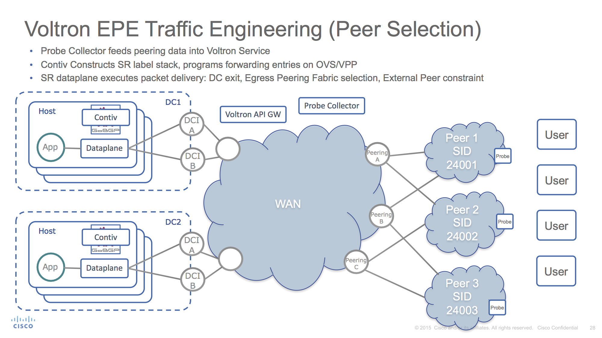

# French Press
### It's like Espresso, but not exactly

French Press is a vService to solve the problem of picking the best SP to use
when you have a choice of many.

At the network level, we have the control plane with probes collecting latency information about the SPs for Voltron:

When the endpoint queries the Voltron API GW, it gets a response that takes it to the nearest peering fabric with a label that indicates which peer to pick: the one with the lowest latency to the client:

Within Voltron, there's a combination of topology, telemetry, and probe metrics to enable the French Press Service to perform its computation and return a result the querying endpoint:

*these docs generated from graffles and PPTs in the [main Voltron docs directory](../../docs)*
